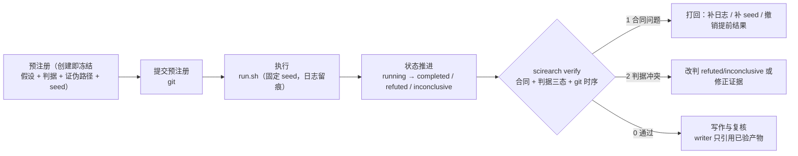

# ScienceRearch

以**可验证性**为中心的科研工作流脚手架：实验预注册 → 隔离执行 → 证据留痕 → 独立复核 → 写作闸门。
配套 Oh My Pi (omp) 子agent 编排设施（`.omp/`），把 agent 的产出约束成可审计的证据链。

[](https://github.com/ckyOL/scienceRearch/actions/workflows/ci.yml)

## 为什么

调研（见 [docs/research-agent-with-omp.md](docs/research-agent-with-omp.md)）给出的硬数据：

- 24 个可运行的自主科研系统中，**83% 开源了代码，但只有 38% 放出 seed/执行轨迹、38% 报告任何新颖性验证方法**（arXiv 2608.05179）。
- 复现基准 PaperBench 上，最强 agent 的复现分仅 **21.0%**，未超过人类 ML PhD 基线（arXiv 2504.01848）。
- 瓶颈已从"agent 能否做完研究"转为"**评审能否验证 agent 产出的 claims**"。

本仓库因此不做"自动写论文"，只做一件更硬的事：**让每条结论都能被机器校验**（判据预注册并冻结、
seed 与日志强制留痕、状态机禁止跳步、git 时序证明判据先于结果、写作只允许引用已验证产物）。

机制本身也接受检验：`analysis/known-truth/` 用已知真值（含零效应、混杂、多重比较、泄漏）问题
度量"预注册 + 独立复核"相对裸 agent 的收益；`docs/project-preregistration.md` 事先写下
什么结果会杀死这个项目。

## 快速开始

第一次拿到仓库：**先读 [docs/getting-started.md](docs/getting-started.md)**（前置条件、omp 角色与护栏配置、
端到端第一次实验走查、故障排查表）。下面是命令速览。

```bash
# 方式 A：uv（推荐）
uv sync --dev
uv run scirearch --help

# 方式 B：pip
python -m venv .venv && source .venv/bin/activate
pip install -e ".[dev]"
scirearch --help
```

```bash
# 1) 预注册一个实验（先写判据与证伪路径，后跑实验）
scirearch new fixed-seed-baseline \
  --hypothesis "固定 seed 下基线方差小于 1%" \
  --metric "std(accuracy) over 5 seeds" \
  --criteria "std_accuracy < 0.01" --criteria "无 NaN" \
  --falsification "5 个 seed 的 std 大于 0.01 即放弃该假设" \
  --seed 1729

# 2) 先提交预注册（git 时序是证据；实验类提交不要 squash 合并）
git add experiments/exp-0001-fixed-seed-baseline && git commit -m "prereg: exp-0001"

# 3) 跑实验（编辑 experiments/exp-0001-fixed-seed-baseline/run.sh 中唯一一行 RUN=）
bash experiments/exp-0001-fixed-seed-baseline/run.sh

# 4) 推进状态（非法跳步会被拒绝；completed 要求判据全满足）
scirearch status experiments/exp-0001-fixed-seed-baseline completed --metrics experiments/exp-0001-fixed-seed-baseline/metrics.json

# 5) 校验合同：退出码 0 通过 / 1 合同非法 / 2 判据冲突
scirearch verify

# 6) 汇总（写作阶段的数据来源；含判据判定与负知识索引）
scirearch report
```

`make help` 列出全部开发命令（`make check` = 格式 + lint + 测试 + 合同校验）。

## 目录结构

```text
.
├─ .omp/                     # Oh My Pi 设施（子agent / skills / hooks / 配置）
│  ├─ agents/                #   研究角色：scout-lit / hypothesizer / experimenter / replicator / critic / writer
│  ├─ skills/                #   实验协议、论文模板（skill:// 按需加载）
│  ├─ hooks/pre/             #   tool_call 级护栏（拦截对 data/raw 的写与破坏性命令）
│  ├─ AGENTS.md RULES.md     #   项目上下文 / 常驻硬规则
│  ├─ WATCHDOG.md            #   advisor 复核清单
│  └─ config.yml             #   项目策略（并发、隔离、advisor）；模型角色表在本机 .omp/settings.json（不进库）
├─ src/scirearch/            # 合同工具：manifest / 状态机 / 校验 / 报告
├─ tests/                    # 针对合同的行为测试
├─ experiments/              # 每个假设一个目录（预注册 + 可重跑入口 + 证据）
├─ data/                     # raw 只读，interim/processed 可重建
├─ analysis/                 # 从 experiments/ 重建的统计与图表；known-truth/ 为自检问题库
├─ paper/                    # 稿件（数字必须可解析到实验 id）
├─ docs/                     # 调研、架构、实验协议、项目级预注册
└─ notes/                    # 探索笔记与死路归档（不构成证据，见 notes/README.md）
```

## 工作流与闸门



合同（`scirearch verify` 强制，CI 同款；退出码 0 通过 / 1 合同非法 / 2 判据冲突）：

| 规则 | 检查点 |
| --- | --- |
| 先判据后结果 | `status=preregistered` 时出现 `metrics.json` → 失败 |
| 预注册冻结 | `criteria` / `hypothesis.md` / 预注册记录的 sha256 在创建时登记，任何事后修改 → 失败 |
| git 时序防火墙 | 预注册提交必须严格早于结果提交，且冻结块未被编辑（CI 以 `fetch-depth: 0` 裁定） |
| 判据与状态一致 | 可求值判据三态求值：`completed` 不得有违反，`refuted` 必须有违反，否则退出码 2 |
| 无 seed 不结论 | 终态必须带 `seed`，且 `logs/` 有非空原始日志 |
| 可重跑 | `run.sh` 存在且可执行 |
| 状态不可跳步 | `preregistered → completed` 被拒绝；终态不可再变更 |
| 留痕 | 每次状态变更写入 `experiment.json.history`（含 reason 与来源） |
| 负知识 | 曾被证伪的判据（按 `criteria_sha256`）重提时命中历史结论并记录 `prior_refutations` |

## 与 Oh My Pi 协作

- `experiments/` 的执行交给 `.omp/agents/experimenter`，spawn 时带 `isolated: true`，产出 patch/分支而非污染主工作树。
- 复核由 `.omp/agents/critic` / `replicator` 与 **advisor**（`WATCHDOG.md` 清单常驻）承担；生成者与复核者用不同 agent、不同模型、不同上下文。
- `.omp/hooks/pre/guard-data-write.ts` 在 `tool_call` 阶段拦截对 `data/raw/` 的写入与破坏性 `bash`。子agent 的审批模式为 `yolo`，这是唯一的人工闸门。
- 细节见 [docs/architecture.md](docs/architecture.md)。

## 文档

| 文档 | 内容 |
| --- | --- |
| [docs/getting-started.md](docs/getting-started.md) | **使用指南**：前置条件、omp 模型角色与护栏配置、端到端第一次实验、故障排查、命令速查 |
| [docs/research-agent-with-omp.md](docs/research-agent-with-omp.md) | 领域调研：AI Scientist v1/v2、Co-Scientist、PaperBench/MLE-bench、验证缺口；开源生态对照（§1.1）与借鉴清单（§7） |
| [docs/architecture.md](docs/architecture.md) | 目录职责、数据流、omp 机制映射、为什么这样摆 |
| [docs/experiment-protocol.md](docs/experiment-protocol.md) | 实验 SOP：预注册哈希、判据三态、seed、日志、状态推进、退出码、复核与写作闸门 |
| [docs/project-preregistration.md](docs/project-preregistration.md) | 项目级主张与自注册 kill 判据（什么会杀死本项目、到期怎么判定） |
| [CONTRIBUTING.md](CONTRIBUTING.md) | 本地开发、提交规范、评审要求 |

## 用它作为模板

本仓库已开启 GitHub **Template repository**（`is_template=true`）。点仓库页面的 **Use this template →
Create a new repository**，或：

```bash
gh repo create my-research --template ckyOL/scienceRearch --public --clone
```

模板实例只复制文件、**不带上游 commit 历史**——正好让 git 时序防火墙从你自己的第一次提交开始记账
（克隆上游历史也不会坏事，只是没必要）。

建库后必做 5 件事：

1. 替换仓库地址占位符：README 徽章、`pyproject.toml`（`Homepage` / `Issues`）、`CITATION.cff`、
   `CHANGELOG.md` 链接、`.github/ISSUE_TEMPLATE/config.yml`，本仓库统一指向 `ckyOL/scienceRearch`。
2. 替换 `LICENSE` 与 `CITATION.cff` 中的版权/作者信息（默认 `ScienceRearch contributors`，可整体替换）。
3. 替换或删除 [docs/project-preregistration.md](docs/project-preregistration.md) 中**上游专属**的主张
   （外部采纳、`gh api` 判定命令、到期日）为你自己的项目主张；按该文件 §4 的修订规则在 CHANGELOG 留痕。
4. **启用分支保护**：把 CI 的 `experiment contract` 设为 main 的 required status check
   （`gh api -X PUT repos/{owner}/{repo}/branches/main/protection -F "required_status_checks[strict]=true" -F "required_status_checks[contexts][]=experiment contract"`）。
   没被依赖的闸门只是日志行——见 [docs/experiment-protocol.md §6](docs/experiment-protocol.md)。
   分支保护**不会随模板复制**，必须在新仓库里重设。

5. **配好本机模型角色表**（模板里刻意不含具体模型 id）：
   `cp .omp/settings.json.example .omp/settings.json`（后者已被 `.gitignore`），把 11 个角色填成本机已认证且在计划内的模型，
   再跑 `make roles-check` 验证 —— 缺本机表、缺契约角色、计划外模型都会 fail loud。
   `.omp/settings.json.example` 是角色契约：模板将来新增角色时，闸门会提示你本地表已分叉。
   细节见 [docs/getting-started.md §2.2](docs/getting-started.md)。

按需调整：`analysis/known-truth/`（可直接跑）。

举报渠道走 GitHub 原生机制，无邮箱：安全与行为准则报告见 [SECURITY.md](SECURITY.md) 与 [CODE_OF_CONDUCT.md](CODE_OF_CONDUCT.md)（私有漏洞报告 + GitHub Report abuse）。

## 许可

[MIT](LICENSE)
