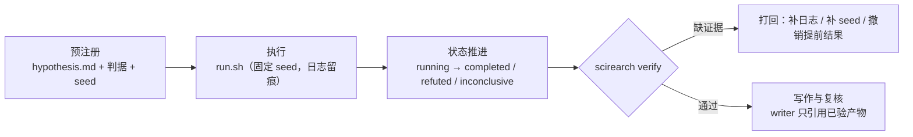

# ScienceRearch

以**可验证性**为中心的科研工作流脚手架：实验预注册 → 隔离执行 → 证据留痕 → 独立复核 → 写作闸门。
配套 Oh My Pi (omp) 子agent 编排设施（`.omp/`），把 agent 的产出约束成可审计的证据链。

[](https://github.com/ckyOL/scienceRearch/actions/workflows/ci.yml)

## 为什么

调研（见 [docs/research-agent-with-omp.md](docs/research-agent-with-omp.md)）给出的硬数据：

- 24 个可运行的自主科研系统中，**83% 开源了代码，但只有 38% 放出 seed/执行轨迹、38% 报告任何新颖性验证方法**（arXiv 2608.05179）。
- 复现基准 PaperBench 上，最强 agent 的复现分仅 **21.0%**，未超过人类 ML PhD 基线（arXiv 2504.01848）。
- 瓶颈已从"agent 能否做完研究"转为"**评审能否验证 agent 产出的 claims**"。

本仓库因此不做"自动写论文"，只做一件更硬的事：**让每条结论都能被机器校验**（判据预注册、seed 与日志强制留痕、状态机禁止跳步、写作只允许引用已验证产物）。

## 快速开始

```bash
# 方式 A：uv（推荐）
uv sync --dev
uv run scirearch --help

# 方式 B：pip
python -m venv .venv && source .venv/bin/activate
pip install -e ".[dev]"
scirearch --help
```

```bash
# 1) 预注册一个实验（先写判据，后跑实验）
scirearch new fixed-seed-baseline \
  --hypothesis "固定 seed 下基线方差小于 1%" \
  --metric "std(accuracy) over 5 seeds" \
  --criteria "< 0.01" --criteria "无 NaN" \
  --seed 1729

# 2) 跑实验（编辑 experiments/exp-0001-fixed-seed-baseline/run.sh 中唯一一行 RUN=）
bash experiments/exp-0001-fixed-seed-baseline/run.sh

# 3) 推进状态（非法跳步会被拒绝）
scirearch status experiments/exp-0001-fixed-seed-baseline completed --metrics experiments/exp-0001-fixed-seed-baseline/metrics.json

# 4) 校验合同：无 seed / 无日志 / 先有结果后有判据，一律失败
scirearch verify

# 5) 汇总（写作阶段的数据来源）
scirearch report
```

`make help` 列出全部开发命令（`make check` = 格式 + lint + 测试 + 合同校验）。

## 目录结构

```text
.
├─ .omp/                     # Oh My Pi 设施（子agent / skills / hooks / 配置）
│  ├─ agents/                #   研究角色：scout-lit / hypothesizer / experimenter / replicator / critic / writer
│  ├─ skills/                #   实验协议、论文模板（skill:// 按需加载）
│  ├─ hooks/pre/             #   tool_call 级护栏（拦截对 data/raw 的写与破坏性命令）
│  ├─ AGENTS.md RULES.md     #   项目上下文 / 常驻硬规则
│  ├─ WATCHDOG.md            #   advisor 复核清单
│  └─ config.yml             #   模型角色、并发、隔离、advisor
├─ src/scirearch/            # 合同工具：manifest / 状态机 / 校验 / 报告
├─ tests/                    # 针对合同的行为测试
├─ experiments/              # 每个假设一个目录（预注册 + 可重跑入口 + 证据）
├─ data/                     # raw 只读，interim/processed 可重建
├─ analysis/                 # 从 experiments/ 重建的统计与图表
├─ paper/                    # 稿件（数字必须可解析到实验 id）
├─ docs/                     # 调研、架构、实验协议
└─ notes/                    # 探索笔记（不构成证据）
```

## 工作流与闸门



合同（`scirearch verify` 强制，CI 同款）：

| 规则 | 检查点 |
| --- | --- |
| 先判据后结果 | `status=preregistered` 时出现 `metrics.json` → 失败 |
| 无 seed 不结论 | 终态必须带 `seed`，且 `logs/` 有非空原始日志 |
| 可重跑 | `run.sh` 存在且可执行 |
| 状态不可跳步 | `preregistered → completed` 被拒绝；终态不可再变更 |
| 留痕 | 每次状态变更写入 `experiment.json.history`（含 reason 与来源） |

## 与 Oh My Pi 协作

- `experiments/` 的执行交给 `.omp/agents/experimenter`，spawn 时带 `isolated: true`，产出 patch/分支而非污染主工作树。
- 复核由 `.omp/agents/critic` / `replicator` 与 **advisor**（`WATCHDOG.md` 清单常驻）承担；生成者与复核者用不同 agent、不同模型、不同上下文。
- `.omp/hooks/pre/guard-data-write.ts` 在 `tool_call` 阶段拦截对 `data/raw/` 的写入与破坏性 `bash`。子agent 的审批模式为 `yolo`，这是唯一的人工闸门。
- 细节见 [docs/architecture.md](docs/architecture.md)。

## 文档

| 文档 | 内容 |
| --- | --- |
| [docs/research-agent-with-omp.md](docs/research-agent-with-omp.md) | 领域调研：AI Scientist v1/v2、Co-Scientist、PaperBench/MLE-bench、验证缺口 |
| [docs/architecture.md](docs/architecture.md) | 目录职责、数据流、omp 机制映射、为什么这样摆 |
| [docs/experiment-protocol.md](docs/experiment-protocol.md) | 实验 SOP：预注册、seed、日志、状态推进、复核 |
| [CONTRIBUTING.md](CONTRIBUTING.md) | 本地开发、提交规范、评审要求 |

## 作为模板使用时

克隆后需替换 3 处占位符：

1. 仓库地址：README 徽章、`pyproject.toml`（`Homepage` / `Issues`）、`CITATION.cff`、`CHANGELOG.md` 链接、`.github/ISSUE_TEMPLATE/config.yml`，本仓库已统一指向 `ckyOL/scienceRearch`。
2. `LICENSE` 与 `CITATION.cff` 中的版权/作者信息（默认 `ScienceRearch contributors`，可整体替换）。
3. `CODE_OF_CONDUCT.md` 与 `SECURITY.md` 中的执行联系人邮箱（默认 `<maintainer@example.com>`）。

## 许可

[MIT](LICENSE)
