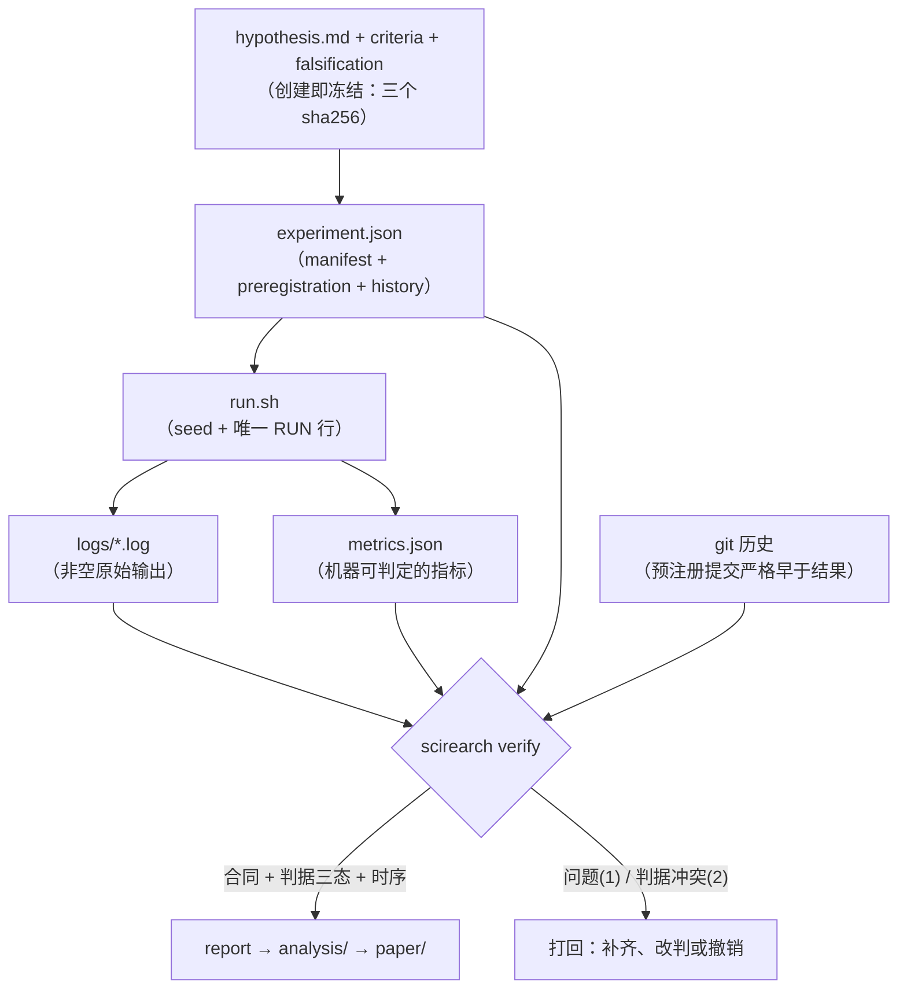

# 架构

一句话：**把"结论"约束成"可被机器校验的产物"**。CLI 负责合同，`.omp/` 负责执行与复核，目录结构负责证据的可寻址性。

## 1. 分层

| 层 | 位置 | 职责 | 变更频率 |
| --- | --- | --- | --- |
| 合同层 | `src/scirearch/` | manifest schema、状态机、校验规则、汇总报告 | 低（改动=收紧规则，需测试） |
| 执行层 | `.omp/agents/`、`.omp/skills/` | 谁来做：侦察/假设/实验/复现/批判/写作 | 中 |
| 护栏层 | `.omp/hooks/pre/`、`.omp/RULES.md` | 不可协商的硬约束（数据只读、命令拦截） | 低 |
| 证据层 | `experiments/`、`data/` | 预注册文档、可重跑入口、日志、指标 | 高（每次实验） |
| 表达层 | `analysis/`、`paper/` | 从证据重建的图表、稿件与自检问题库 | 高 |

依赖方向单向向下：表达层只能引用证据层，证据层只能由执行层产出，护栏层可拦截任何一层的动作，合同层不依赖其他层（纯标准库实现，可在 CI 独立运行）。

## 2. 数据流

`experiment.json` 是唯一机读真相源；`hypothesis.md` 是它的可读镜像（给人与 agent 看）。
二者由 `scirearch new` 同时生成并登记哈希，**任何事后修改都会被检出**；git 历史另行证明
预注册提交严格早于结果提交（同一提交即违规）。

## 3. 目录职责

| 目录 | 允许写入者 | 禁止 | 生命周期 |
| --- | --- | --- | --- |
| `data/raw/` | 人工导入脚本 | agent 写入（hook 拦截） | 永久只读 |
| `data/{interim,processed}/` | 实验脚本 | 手工修补 | 可重建，不入库 |
| `experiments/<id>/` | `experimenter` / `replicator` | 手改 `metrics.json`；编辑 `hypothesis.md` 或判据（哈希冻结） | 永久（证据） |
| `analysis/` | `writer` / 人 | 手写数字（必须由脚本产出） | 可重建 |
| `paper/` | `writer` | 引用未验证产物 | 版本化 |
| `notes/` | 任何 agent | —（死路归档须引用实验 id 或可寻址证据） | 可丢弃（但建议保留索引） |
| `.omp/` | 人 | 实验产出 | 低频演进 |

## 4. omp 机制落点

| 需求 | omp 机制 | 在本仓库的用法 |
| --- | --- | --- |
| 并行侦察 | `task` batch（`context` 必填）+ `scout` | 文献/代码/数据三路只读侦察 |
| 并行实验 | eval `workpool` 或 `task` batch | `experimenter` 池化，池名即作业 id |
| 不污染主树 | `isolated: true` + git 分支/patch | 实验结果经 merge 成为证据 |
| 结构化产出 | agent frontmatter `output` / 调用方 `outputSchema` | 强制实验报告字段齐全 |
| 长任务 | `hub op:"start"` 托管 + `hub op:"wait"` | 训练/仿真进程，日志可 tail |
| 复用而非重派 | `hub send` 唤醒 parked agent；`history://` | 追问同一实验员，保留上下文 |
| 独立复核 | `critic`/`replicator` agent + `advisor` + `WATCHDOG.md` | 生成者与复核者不同 agent/模型/上下文 |
| 硬护栏 | `.omp/hooks/pre/*.ts` 的 `tool_call` 拦截 | 子agent 审批模式为 `yolo`，hook 是唯一人工闸门 |
| 上下文沉淀 | `memory.backend: local` + `autolearn` | 跨会话记住项目结论与教训 |
| 探索分支 | `/tree`、`/branch`、`checkpoint`+`rewind` | 只回滚对话；**文件回滚一律用 git** |

## 5. 设计取舍

1. **不做自动写作**：写作质量不是当前瓶颈，可验证性才是（见调研 §1）。`writer` 的 `tools` 中不含 `bash`/`eval`，无法自行生成数字。
2. **不用 `checkpoint` 做文件快照**：omp 的 `checkpoint`/`rewind` 只记录对话状态，不含工作区（`omp://tools/checkpoint.md` 明确说明）。文件级回滚用 git 与 `isolated` 分支。
3. **日志入库**：`logs/` 是终态的必要证据，默认提交；超大日志走外部存储 + 在 manifest 登记 hash（见 `experiments/README.md`）。
4. **合同用标准库实现**：`scirearch` 零运行时依赖，保证在任意 CI/子agent 环境可执行，不因依赖漂移而静默失效。
5. **状态机而非自由字段**：`preregistered → running → {completed, refuted, inconclusive, abandoned}`。终态不可回退；每次变更留 `history`。配合预注册哈希与 git 时序，"事后改判据"在结构上不可能——改内容、重算哈希、改状态各有独立检查。
6. **判据机械化，人工兜底显式化**：可求值判据（`指标 运算符 数值`）由 `verify` 三态求值，`report` 标 `[机器]`；自由文本判据标 `[人工]`。二者不合并——机器判定是完整性控制，不是 attestation（借鉴 ArmProof 的自我限定与 honest-signal 的数字二分）。
7. **允许负结果与负知识**：`refuted`/`inconclusive` 与 `completed` 同等的证据要求；被证伪判据按 `criteria_sha256` 进入负知识索引，重提必须携带新证据（借鉴 dsh-research-report）。
8. **自检先于自夸**：`analysis/known-truth/` 用已知真值（含零效应）问题度量"预注册 + 独立复核"相对裸 agent 的收益；结论为负照样按终态归档（借鉴 nullius 的已知真值自证）。
9. **项目级预测同样可证伪**：`docs/project-preregistration.md` 登记项目主张、kill 判据与到期判定命令，到期按判据执行，不做事后合理化（借鉴 honest-signal 的自注册 kill 判据）。
