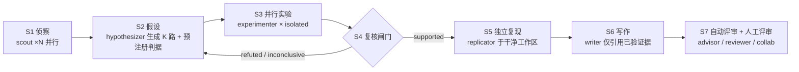

# 科研 Agent × Oh My Pi：调研与落地

> 调研范围：omp harness 机制文档（子agent / hub / eval / 隔离 / advisor / artifacts / tree / memory / skills）+ 9 篇一手文献。
> 标注约定：引用文献与 omp 机制均为可核查事实；带 **（推论）** 的段落是设计建议，非既有行为。

---

## 0. TL;DR

1. **领域状态**：端到端 AI Scientist 已能产出过 workshop 评审线的稿子（AI Scientist-v2，2025），但瓶颈已从"能否跑完流水线"转为"评审能否验证 claims"——2026 综述实测：24 个可运行系统中 83% 开源代码，仅 38% 放出 seed/执行轨迹、38% 报告任何新颖性验证方法。
2. **omp 的定位**：不提供科研框架，而是提供 **agent 运行时**——子agent 编排、隔离工作区、证据留痕、独立复核、会话分支。科研框架（AI Scientist 式的流水线）由你自己用 agent 定义 + 设置文件组装。
3. **核心用法**：`scout` 侦察 → `task`/`workpool` 并行假设与实验 → `isolated` 分支隔离 → `advisor`/`reviewer` 独立复核 → `agent://`/`artifact://`/git 留痕 → `/tree` 管理探索分支。
4. **项目架构**：`.omp/agents/*.md` 定义研究角色；`.omp/AGENTS.md` + `RULES.md` 定义实验规范；`experiments/` `artifacts/` `paper/` 承载可复现产物；`WATCHDOG.md` 承载复核清单。
5. **红线**：无 seed、无执行轨迹、无独立复核的结果，不得流入写作阶段（见 §6）。

---

## 1. 领域现状：三种形态、一条流水线、一个缺口

| 系统 | 形态 | 关键机制 | 报告结果 |
| --- | --- | --- | --- |
| **AI Scientist v1** (arXiv 2408.06292) | 端到端流水线 | 生成想法→写码→跑实验→画图→写论文→自动评审，可循环 | 3 个 ML 子领域，**每篇 < $15**；自动评审逼近人类评分 |
| **AI Scientist-v2** (2504.08066) | 端到端 + 搜索 | **agentic tree search** + 专职 experiment manager agent；VLM 反馈迭代图表 | 3 篇全自动稿件投 ICLR workshop，**1 篇超过人类平均接收阈值** |
| **Co-Scientist** (2502.18864) | 假设生成器（人在环） | 多 agent + **异步任务执行框架** + tournament evolution（生成/批判/精炼） | 生物医学三场景；AML 药物重定位候选经**体外实验**验证 |
| **OmniScientist** (2511.16931) | 生态/基础设施 | 引用网络知识系统 + 协作协议 OSP + 盲评 Elo 平台 ScienceArena | 主张：科研是社会协作过程，需归因、评审、知识网络 |
| **aiXiv** (2508.15126) | 出版/评审平台 | 多 agent 提交→评审→迭代修订；提供 **API/MCP 接口** 接入异构 agent | 迭代评审后稿件质量提升 |
| **PARNESS** (2605.05258) | 编排框架 | 薄 DAG kernel + 四字段 Agent contract；**论文-代码仓库链接**；跨运行知识库 | 论点：固定控制流（线性/状态机/单循环）是现有系统的刚性根源 |

**能力现状（基准）**

| 基准 | 测什么 | 数字 |
| --- | --- | --- |
| MLE-bench (2410.07095) | 75 个 Kaggle 竞赛 | 最佳配置（o1-preview + AIDE）在 **16.9%** 竞赛达到铜牌 |
| PaperBench (2504.01848) | 复现 20 篇 ICML 2024 Spotlight/Oral | 8316 个可评分任务；最佳 agent 复现分 **21.0%**，未超过招募的 ML PhD 基线 |

**验证缺口（关键）** — Autonomous Research Agents: A Survey (2608.05179)：
筛选 125 项、纳入 35 项、全文编码 26 项（24 个可运行系统）。编码维度含生命周期阶段、自主等级、评估方法、发布产物、人在环点、**新颖性验证**、**结果筛选披露**。结论：

- 代码发布已普及（83%），但**可复现级产物稀缺**：seed/执行轨迹 38%，新颖性验证方法 38%；
- 9 个闭环 L4 系统中 7 个只是 mechanical rerun，1 个为作者自述无外部核查；**无任何 LLM 时代系统证明存在经外部验证的 in-loop oracle**；
- 综述判断：核心瓶颈是"**评审能否验证 agent 产出的 claims**"。

**（推论）对工具选型的三条约束**：

1. 自动化写作不是稀缺能力，稀缺的是**可审计的实验轨迹** → 优先把算力投在隔离执行、日志、seed 管理。
2. 自动评审不可作为接受判据（它同时是"生成物"和"裁判"）→ 需要**结构上独立**的复核者（不同 agent、不同模型、不同上下文）。
3. 假设搜索（tree search / tournament）的收益已见诸 v2 与 Co-Scientist → 需要廉价的**分支并行 + 分支淘汰**机制，而非单条长上下文。

---

## 2. omp 能力 ↔ 科研环节映射

| 科研环节 | omp 机制 | 入口 |
| --- | --- | --- |
| 文献侦察、代码库测绘 | `scout`（只读子agent，`read` 返回原文而非结构化摘要） | `task` 指定 `agent: "scout"` |
| 网页/论文检索 | `web_search`、`read`（可直接读 arXiv/URL）、浏览器 prelude | 主 agent 或子agent 工具 |
| 假设生成（并行多路） | `task` batch（一次调用多 spawn）或 eval `workpool`（keep-alive 池） | `task.batch`（默认开） |
| 实验执行（长时/有状态） | eval 持久 kernel（py/js 各自保留状态）+ `bash`；长任务交给 `hub op:"start"` 托管 | `eval` / `hub` |
| 环境隔离、避免污染主仓 | `isolated: true` → APFS/reflink/overlay 级工作区，产出 patch 或 `omp/task/<id>` 分支 | `task.isolation.enabled` |
| 证据留痕 | 子agent 输出落 `<id>.md`（`agent://`）、完整转录（`history://`）、工具输出溢出（`artifact://`）、会话 JSONL | 内置，无需配置 |
| 独立复核 | bundled `reviewer` / `security-reviewer`；**advisor** 旁路审查（含 `WATCHDOG.md` 项目级复核清单） | `advisor.enabled` / `WATCHDOG.yml` |
| 人在环评审 | `/collab` 分享会话（远端 guest 可 prompt/打断/操作子agent，E2E 加密，view/control 两级链接） | `/collab` |
| 探索分支管理 | `/tree`（同文件内换 leaf）、`/branch`、`/fork`；`checkpoint`+`rewind`（**仅对话状态，非文件系统**） | `/tree` 等 |
| 长会话上下文控制 | 自动压缩、`memory.backend`（跨会话摘要/教训）、`learn` 工具 | `/memory` |
| 方法论复用 | Skills（`SKILL.md`）、`AGENTS.md` 上下文、`RULES.md` 常驻规则 | `skill://<name>` |
| 成本控制 | `modelRoles` 角色路由、`prewalk`（首次写操作后切廉价模型）、`task.softRequestBudget`、`task.maxRuntimeMs` | 设置文件 |
| 程序化驱动 | Bun SDK（`createAgentSession`）与 RPC 模式 | `omp://sdk.md` |

---

## 3. 子 agent 体系（重点）

### 3.1 定义与内置角色

内置 5 个：`scout`（只读侦察）、`reviewer`、`security-reviewer`、`task`（通用）、`sonic`（低推理机械任务）。
自定义 agent 放在 **项目 `.omp/agents/*.md`** 或 **用户 `~/.omp/agent/agents/*.md`**，正文即该 agent 的 system prompt，frontmatter 控制能力：

| 字段 | 作用 | 科研场景用法 |
| --- | --- | --- |
| `name` / `description` | 必填；`description` 决定主 agent 何时选用 | 写清"何时该派我" |
| `model` | 单值 / CSV / 数组（按序 fallback），支持 `@role` 别名 | `model: "@review:high"` |
| `tools` | 显式工具白名单（自动附加 `yield`） | 只读审计员限定 `read,grep,glob` |
| `spawns` | `*` / CSV / 数组；缺省且 `tools` 含 `task` 时为 `*` | 组长 agent 允许再分派 |
| `output` | 结构化输出 schema（可被调用方 `outputSchema` 覆盖） | 锁定实验报告字段 |
| `blocking` | 该 agent 的 spawn 走内联阻塞而非后台 | 关键路径的串行阶段 |
| `autoloadSkills` | 首次提示前注入指定 skills | 注入 `experiment-protocol` |
| `read-summarize: false` | `read` 返回原文（`scout` 默认如此） | 精确读论文/数据字典 |
| `prewalk` / `advisor` | 首写后切廉价模型 / 配对 advisor | 省钱的 executor；受复核的实验员 |

**示例**（实验员：只读工具起步、结构化报告、自带 advisor）：

```md
---
name: experimenter
description: 在隔离工作区内实现并运行单个假设的实验，产出可复现证据。不做写作。
model: "@worker"
tools: [read, grep, glob, edit, write, bash, eval]   # 不含 task -> 叶子执行者
advisor: true         # 每个 spawn 配一个 advisor
output:
  type: object
  required: [hypothesis, command, seed, metrics, artifacts, verdict]
  properties:
    hypothesis: { type: string }
    command: { type: string }
    seed: { type: integer }
    metrics: { type: object }
    artifacts: { type: array, items: { type: string } }
    verdict: { enum: [supported, refuted, inconclusive] }
---
你是实验执行者。规则：
1. 只在分配的隔离工作区内改动；数据只读。
2. 每条结论必须附：可重跑命令 + seed + 原始输出路径。
3. 结果与预期不符时如实报告 refuted，禁止调参掩盖。
4. 结束用 yield 提交符合 schema 的报告。
```

### 3.2 发现与优先级（决定"同名 agent 谁来生效"）

顺序即优先级（先命中先赢，大小写敏感，按文件名词典序）：

1. 最近的**项目** `.omp/agents/`
2. **用户** `.omp/agent/agents/`
3. 扩展包 `agents/`（CLI `--extension` → 项目 `extensions:` → 用户 `extensions:` → 已装插件）
4. Claude marketplace 插件（仅在 `claude-plugins` provider 开启时）
5. 内置 agent

直接跨harness 目录（`.claude/agents`、`.codex/agents`、`.gemini/agents`）**不**读取。单个坏文件只告警跳过，不中断发现。执行时**重新发现**（不是用描述期快照），所以会话中途新增 agent 文件即可生效。

### 3.3 调度：并发、批、后台

- **一次调用 = 一个批次**：`task.batch` 默认开，形如 `{ context, tasks: [{name, agent, task, outputSchema?, isolated? }] }`；`context` 必填，作为共享背景注入每个子agent 的 system prompt。`context` 是跨任务契约（接口、数据格式、验收标准）的落点。
- **并发上限**：`task.maxConcurrency`（默认 32，`0` 无界）。会话级信号量，跨并行 `task` 调用与 eval 扇出统一生效。
- **后台作业**：`async.enabled=true` 时普通 spawn 在后台跑，结果作为异步消息回注；agent 类型声明 `blocking: true` 则内联。
- **递归深度**：`task.maxRecursionDepth` 默认 **2**（负值无上限）；达到上限时子agent 的 `task` 工具被摘除且 spawns 清空。
- **禁派**：`task.disabledAgents` 拒绝指定 agent。
- **Plan mode**：父会话处于 plan mode 时，子agent 工具被裁剪为 `read/grep/glob/web_search`（外加其自身声明的 `ast_grep`），spawns 清空——**规划期天然只读**，适合"先侦察后执行"两段式。

### 3.4 生命周期与通信（科研里最重要的"复用而非重派"）

状态机：`running → idle →（TTL 420s 默认）parked → 被消息唤醒 → idle`；`aborted` 为终态。

- **idle/parked 可复用**：`hub op:"send"` 唤醒 parked agent，它保留全部上下文；`history://<id>` 读其转录，`agent://<id>` 读其最终产出。
- **对等消息**：`hub` 的 `send`（可 `await: true` 等回复）、`inbox`、`peek`、`list`；邮箱上限 100 条，awaited send 超时默认 `irc.timeoutMs`=120s。
- **等待语义**：`hub op:"wait"` 一次调用 race 三类事件——作业完成 / 收到消息 / 自适应等待窗口（5s→10s→30s→1m→5m 逐级上升）。完全阻塞时才用；否则保持 kernel 空闲以服务 `@tool`。
- **不继承对话历史**：子agent 只有工作区、skills、`local://` 共享根、已批准计划引用。**跨 agent 的共享背景必须显式写进 `context` 或 `local://` 文件**——这是科研流水线里最常见的失效点。

### 3.5 隔离与合并（并行实验的前提）

- `task.isolation.enabled` 打开后，`isolated: true` 的 spawn 在独立工作区运行；backend 自动择一（`apfs`/`btrfs`/`zfs`/`reflink`/`overlayfs`/`projfs`/`block-clone`/`rcopy`，失败逐级 fallback）。
- 合并两式：**patch 模式**（回收根 patch）或 **branch 模式**（提交到 `omp/task/<id>` 再 cherry-pick 回父仓）。
- 隔离 agent 完成后工作区即销毁，**不可复活**（转录仍可读）；嵌套 git repo 独立 diff、独立合并。
- 用途：并行假设互不污染；失败的假设直接丢弃而不留脏改动。

### 3.6 预算、模型与降本

| 机制 | 默认 | 说明 |
| --- | --- | --- |
| `task.softRequestBudget` | 200 请求 | 越线注入收敛提示，1.5× 强制收尾并 yield 部分结论 |
| `task.maxRuntimeMs` | 0（关） | 墙钟硬上限，作用于每个 spawn |
| `task.enableEffort` + `effort: lo/med/hi` | 关 | 按 spawn 调节思考档，映射到模型支持的最低/中/最高档 |
| 输出上限 | 500KB / 5000 行 | 超出部分仍完整写入 `<id>.md` |
| `prewalk` | 关 | 首写操作后从强模型切到 `@smol`；`task.agentPrewalk` 可按 agent 覆盖 |
| `modelRoles` | — | 角色别名（`@review`、`@smol`、`@slow`…）集中管理模型，agent 文件只引用别名 |
| `task.agentModelOverrides` | — | 按 agent 名钉死模型，优先于 frontmatter |

**（推论）科研成本结构建议**：侦察/机械整理用 `scout`/`sonic`；假设生成与实验调试用中档模型 + `effort` 调档；结论裁定、复核、新颖性审查用最高档（预算集中在此处）。

### 3.7 复核型 agent：advisor 与 WATCHDOG

- `advisor.enabled: true` + `modelRoles.advisor` 挂载旁路审查模型；它独立于主 agent 的工具会话，默认工具 `read/grep/glob`，只有 `advise` 能回注。
- 严重度三档：`nit`（下一步边界旁注）、`concern`/`blocker`（可打断并触发回合）。`advisor.immuneTurns`（默认 3）限制打断频率；`advisor.syncBacklog` 控制主 agent 等待复核的强度（`off`/`1`/`3`/`5`，等待上限 30s）。
- **`WATCHDOG.md`** 是 advisor 专属提示（不进主 agent 上下文），`WATCHDOG.yml` 可定义多 reviewer 花名册（各自 model / tools / instructions）。子agent 默认无 advisor，按 agent frontmatter 或 `task.agentAdvisor` 逐个开启。
- 用途映射：把"审稿人 checklist"写成 `WATCHDOG.md`（如：禁止引用未落盘的结果、每个数字必须指向 artifact、图表必须有原始数据源），让复核持续在线而不是事后一次性 review。
- advisor 不参与 `hub` 对等消息、不可唤醒/杀死；`__advisor*.jsonl` 仅作审计轨迹。

---

## 4. 项目架构：科研仓库怎么摆

```text
repo/
├─ .omp/
│  ├─ AGENTS.md              # 项目背景、数据字典、环境约定（自动注入，最近的非空 .omp 生效）
│  ├─ RULES.md               # 短硬规则，每请求常驻（如"禁止改动 data/raw"）
│  ├─ config.yml             # 项目级设置：并发、隔离、advisor、memory
│  ├─ agents/                # 研究角色定义
│  │  ├─ scout-lit.md        #   文献侦察（只读）
│  │  ├─ hypothesizer.md     #   假设生成（多路，高 effort）
│  │  ├─ experimenter.md     #   实验执行（隔离、结构化报告）
│  │  ├─ replicator.md       #   独立复现（只读原仓 + 重跑）
│  │  ├─ critic.md           #   方法学批判（禁改文件）
│  │  └─ writer.md           #   写作（只允许引用已验证 artifact）
│  ├─ skills/
│  │  ├─ experiment-protocol/SKILL.md   # 实验SOP：seed、日志格式、失败留痕
│  │  └─ paper-template/SKILL.md        # 论文骨架与引用规范
│  ├─ hooks/pre/*.ts         # 例：拦截对 data/raw 的写操作、强制结果目录带时间戳
│  └─ WATCHDOG.md            # advisor 复核清单
├─ data/  raw/ | interim/ | processed/     # 原始数据只读；派生物可重建
├─ experiments/
│  ├─ exp-0001-<slug>/       # 每个假设一个目录
│  │  ├─ hypothesis.md       #   假设 + 预注册的判据（先写判据，后跑实验）
│  │  ├─ run.sh              #   可重跑入口（固定 seed）
│  │  ├─ metrics.json
│  │  └─ logs/               #   原始 stdout/stderr（可由 artifact:// 指向）
├─ analysis/                 # 汇总统计与图表脚本（从 experiments/ 重建，不手改数字）
├─ paper/                    # 稿件、图、bib
├─ notes/                    # 探索笔记（可丢弃）
└─ .git                      # 每个 experiment 一个 commit = 证据链
```

**映射规则**

| 目录 | 由谁读写 | omp 落点 |
| --- | --- | --- |
| `.omp/agents/` | 人 | 子agent 角色；名字即 `task` 的 `agent` 参数 |
| `.omp/AGENTS.md` | 人 | 自动注入每个会话（含子agent）的项目上下文 |
| `.omp/RULES.md` | 人 | 常驻硬规则（"数据只读""禁止手改 metrics.json"） |
| `.omp/skills/` | 人 / agent 自动学习 | `autoloadSkills` 注入，或 `read skill://x` 按需读 |
| `experiments/` | 隔离型 experimenter | `isolated: true` 分支产出，merge 后成证据 |
| `analysis/` `paper/` | writer / analyst | 只允许引用 `agent://`/`artifact://`/git 中的已验证产物 |
| `.omp/WATCHDOG.md` | 人 | advisor 复核清单（不进主上下文） |
| `notes/` | 主 agent | 自由探索区，不构成证据 |

**设置骨架（`.omp/config.yml`）**

```yaml
modelRoles:                 # 角色集中管理，agent 文件只写 @别名
  default: anthropic/claude-sonnet-4-5:medium
  smol: openai/gpt-5-mini
  advisor: anthropic/claude-sonnet-4-5:high
  review: anthropic/claude-sonnet-4-5:high
  worker: openai/gpt-5.4:medium      # experimenter 等执行型 agent 的默认档

task:
  maxConcurrency: 8         # 并发实验数：受 CPU/GPU/配额约束，不要吃满
  maxRecursionDepth: 2
  isolation:
    enabled: true           # 并行实验的硬前提
  softRequestBudget: 200
  disabledAgents: []        # 例如暂时封禁 replicator

advisor:
  enabled: true
  syncBacklog: 1            # 每个 delta 后等复核追上（最多 30s）

memory:
  backend: local            # 跨会话沉淀项目结论与教训
autolearn:
  enabled: true             # 允许 learn 工具写入 learned.md
checkpoint:
  enabled: true             # 探索前打点，便于 rewind 收束
```

---

## 5. 一条可复制的流水线



**S1 侦察（并行只读）**

```json
{
  "context": "项目根 = 当前仓库。输出契约：每条结论附 [文件:行] 或 URL；不确定的标注 UNKNOWN。禁止推测。",
  "tasks": [
    { "name": "LitScout",   "agent": "scout", "task": "通读 notes/related/*.pdf 的摘要与图表标题，抽取：(a) 已解决，(b) 未解决，(c) 与本项目方法冲突之处。" },
    { "name": "RepoScout",  "agent": "scout", "task": "测绘 src/ 的数据流入口与配置面；列出可插入实验的最小改动点。" },
    { "name": "DataScout",  "agent": "scout", "task": "审计 data/raw：规模、缺失、泄漏风险（时间/分组），给出切分建议。" }
  ]
}
```

**S3 并行实验（workpool：池化 keep-alive worker，避免每次冷启）**

```python
pool = workpool(
    agent="experimenter",
    name="exp-round-1",
    context="判据、数据路径、日志格式见 local://protocol.md",
)
for h in hypotheses:  # K 条假设
    pool.push(h)
# 池名即聚合作业 id；阻塞时离开 eval，用 hub 等待，kernel 保持可服务 @tool
```

```json
{ "op": "wait", "ids": ["exp-round-1"] }
```

**S4 复核闸门（结构独立）** — 三个互不共享上下文的检查者，任一 `concern` 即回炉：

```json
{
  "context": "只读审计。目标是推翻结论，而非确认。输出：{findings:[{claim, evidence, severity}]}；无发现也必须给出尝试过哪些反例搜索。",
  "tasks": [
    { "name": "MetricAudit",  "agent": "critic",       "task": "核对 metrics.json 与原始日志逐项一致；找出任何被丢弃的 run。" },
    { "name": "StatAudit",    "agent": "critic",       "task": "检查显著性、多重比较、方差来源；复算关键区间。" },
    { "name": "LeakAudit",    "agent": "security-reviewer", "task": "检查训练/评估切分是否泄漏，是否触碰 data/raw。" }
  ]
}
```

**S5 独立复现** — `isolated: true` + 干净 worktree 重跑，只允许读原实验目录：

```json
{ "context": "不得复用原实验的任何缓存或中间产物。",
  "tasks": [{ "name": "Replicator", "agent": "replicator",
              "task": "读取 experiments/exp-0012-*/run.sh 与 hypothesis.md，在新工作区从零重跑；报告指标是否落在预注册判据内。",
              "isolated": true }] }
```

**S6 写作闸门** — writer 的 `tools` 不含 `bash`/`eval`，且 `RULES.md` 规定：文中每个数字必须能解析到 `agent://` 或 `artifact://` 或 git commit；advisor 常驻拦截未验证引用。

**S7 评审** — `/collab` 开 view-only 链接给合作者实时旁观；需要写入权限再发 control 链接（链接即信任边界，按密钥对待）。

---

## 6. 反模式与风险

| 反模式 | 后果 | 对策 |
| --- | --- | --- |
| writer 直接消费子agent 的口头结论 | 幻觉进入稿件；无法回溯 | 只允许引用 `agent://`/`artifact://`/git 中的产物；`RULES.md` 明写 |
| 无 seed、无原始日志 | 复现失败（综述：仅 38% 系统放出 seed/轨迹） | `experiments/*/run.sh` 固定 seed；原始输出保留为 artifact |
| 用同一个 agent/模型既生成又评审 | 自我一致性偏差 | 复核者用不同 agent + 不同模型 + 新上下文；必要时 `/tree` 开新分支审 |
| 单上下文堆所有假设 | 上下文耗尽、想法趋同 | `task` batch / `workpool` 并行多路，按判据淘汰 |
| 把自动评审分数当接收判据 | PaperBench 最佳 agent 仅 21.0% 复现分，未超人 | 自动评审只做初筛；结论以独立复现 + 人工评审为准 |
| `checkpoint` 当文件系统快照用 | 它只记录对话状态，**不含工作区** | 文件级回滚用 git（`isolated` 分支 / commit）；`checkpoint` 只用于探索式侦察的上下文收束 |
| 子agent 期待继承对话 | 它不继承历史（只有工作区/skills/`local://`） | 共享背景写进 `context` 或 `local://` 文件 |
| 无上限扇出 | 32 并发 × 长任务 = 配额/成本失控 | `task.maxConcurrency` 按硬件收敛；`softRequestBudget`/`maxRuntimeMs` 设上限 |
| 无人值守实验无人拦 | 子agent 的 `tools.approvalMode` 被强制为 `yolo`（headless 无 UI 可确认），危险命令不会弹窗 | 用 `.omp/hooks/pre/*.ts` 在 `tool_call` 阶段 `block` 或改写 `input`；`data/raw` 挂只读 |
| advisor 当执行者 | 它不可被消息、不可复活，且默认只读 | 分工：advisor 只提意见；执行交给普通子agent |
| 人类评审在会话结束后才介入 | 早期方向性错误被放大 | `advisor` 在线 + `/collab` 实时旁观 + `WATCHDOG.md` 常驻清单 |

---

## 7. 参考

**文献**（均为 arXiv 摘要原文核对）
- Lu et al., *The AI Scientist* — 2408.06292
- Yamada et al., *The AI Scientist-v2* — 2504.08066
- Gottweis et al., *Accelerating scientific discovery with Co-Scientist* — 2502.18864
- Starace et al., *PaperBench* — 2504.01848
- Chan et al., *MLE-bench* — 2410.07095
- Ding et al., *Autonomous Research Agents: A Survey of AI Scientists and the Verification Gap* — 2608.05179
- Shao et al., *OmniScientist* — 2511.16931
- Zhang et al., *aiXiv* — 2508.15126
- Wang & Luan, *PARNESS* — 2605.05258

**omp 机制文档**（`omp://` 内可读）
- `tools/task.md`、`task-agent-discovery.md`、`agent-hub.md` — 子agent 全生命周期
- `tools/hub.md` — 对等通信 / 作业控制 / 进程托管
- `tools/eval.md` — 持久 kernel、`agent()`、`workpool()`、`@tool`
- `advisor-watchdog.md` — 独立复核
- `blob-artifact-architecture.md` — `agent://`、`artifact://` 的存储与解析
- `tree.md`、`tools/checkpoint.md` — 分支与回滚
- `memory.md`、`skills.md`、`context-files.md`、`hooks.md` — 沉淀与自动化
- `collab.md`、`sdk.md` — 人机协作与程序化编排
